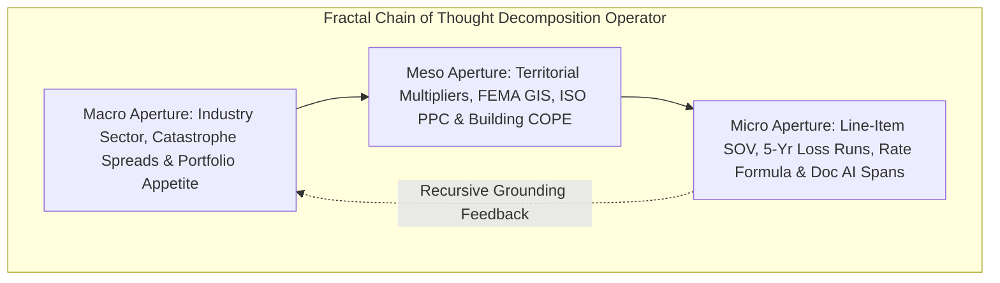

# 🏛️ Duck Creek Underwriting Intelligence: Production-Ready Neuro-Symbolic Multi-Agent Platform

[](https://cloud.google.com)
[](https://cloud.google.com)
[](https://cloud.google.com)
[](https://cloud.google.com/vertex-ai)
[](https://cloud.google.com)
[](https://cloud.google.com)
[-brightgreen)](https://pytest.org)

**Duck Creek Underwriting Intelligence** is an enterprise-grade, production-ready multi-agent system built upon **Google Agent Development Kit (ADK) 2.x**, **A2UI (Agent UI)**, and the **Google Gen AI SDK (`google-genai`)** powered by **Gemini Enterprise on Vertex AI**. 

Engineered under **Google's AI Black Belt methodology**, the platform functions as an explainable, auditable, and trusted advisor for commercial property and casualty insurance underwriting. It eliminates manual data re-keying, accelerates quote turnaround times from days to seconds, guarantees mathematical determinism, and enforces a mechanical zero-hallucination barrier.

---

## 📐 System Topology & Architectural Depiction

```mermaid
graph TB
    subgraph ClientTier ["Presentation & User Interaction Tier (A2UI)"]
        UI_Broker["Broker Portal (Dynamic A2UI Engine)"]
        UI_UW["Underwriter Workbench (HITL Referral Queue & Audit)"]
        A2UI_Renderer["Dynamic A2UI Component Factory (SSE / JSON-RPC 2.0)"]
        UI_Broker <--> A2UI_Renderer
        UI_UW <--> A2UI_Renderer
    end

    subgraph SecurityGateway ["Security & Zero-Trust Tool Authorization"]
        AgentGateway["Agent Gateway (Envoy Ingress / Egress Proxy)"]
        AgentIdentity["Agent Identity Provider (SPIFFE / Workload Identity)"]
        AgentGateway <--> AgentIdentity
    end

    subgraph OrchestrationTier ["Orchestration Tier (Cloud Run / ADK 2.x)"]
        Controller["Reactive SSE Controller API (Flask / ASGI)"]
        Supervisor["Lead Underwriting Orchestrator (FCoT Supervisor)"]
        EpistemicMemory["Shared Epistemic Citation Registry & Session Store"]
        Controller --> Supervisor
        Supervisor <--> EpistemicMemory
    end

    subgraph SpecialistAgentMesh ["Specialist Subagent Mesh (Hub-and-Spoke Topology)"]
        A_Intake["01. Intake & Doc AI Agent"]
        A_Clearance["02. Clearance & Sanctions Agent"]
        A_Appetite["03. Appetite & Eligibility Agent"]
        A_Enrich["04. Data Enrichment Agent"]
        A_Exposure["05. Exposure & COPE Analysis Agent"]
        A_Loss["06. Loss History & Claims Agent"]
        A_SymbolicRating["07. Symbolic Rating Engine (Zero-LLM Actuarial Core)"]
        A_QuoteStruct["08. Quote Options Structuring Agent"]
        A_Grounding["09. Compliance & Grounding Guard"]
        A_Triage["10. Triage & Referral Agent (STP vs HITL)"]
        A_Lifecycle["11. Quote Lifecycle State Machine"]
        A_Audit["12. Regulatory Governance & Audit Pack Agent"]

        Supervisor --> A_Intake
        Supervisor --> A_Clearance
        Supervisor --> A_Appetite
        Supervisor --> A_Enrich
        Supervisor --> A_Exposure
        Supervisor --> A_Loss
        Supervisor --> A_SymbolicRating
        Supervisor --> A_QuoteStruct
        Supervisor --> A_Grounding
        Supervisor --> A_Triage
        Supervisor --> A_Lifecycle
        Supervisor --> A_Audit
    end

    subgraph ComputeMesh ["GKE Scalable Worker Tier"]
        GKE_DocExtract["Doc AI High-Throughput Batch Parser Pods"]
        GKE_EnvoyMesh["Envoy Sidecar Mesh (mTLS + SPIFFE Verification)"]
    end

    subgraph EnterpriseDataServices ["Google Cloud Enterprise Stack (9 Services)"]
        GCS["1. Cloud Storage (Submissions, Loss Runs, SOVs)"]
        DocAI["2. Document AI API (OCR & Entity Spans)"]
        BigQuery["3. BigQuery (Event Ledger & Vector Search)"]
        Apigee["4. Apigee API (Hazard & Geospatial Orchestration)"]
        Looker["5. Looker API (Semantic Layer & Dashboards)"]
    end

    A2UI_Renderer <-->|SSE Stream / JSON-RPC 2.0| Controller
    Controller --> SecurityGateway
    SpecialistAgentMesh --> SecurityGateway
    SecurityGateway --> EnterpriseDataServices
    SecurityGateway --> ComputeMesh
    A_Intake <--> GCS & DocAI
    A_Enrich <--> BigQuery & Apigee
    A_Audit <--> BigQuery & Looker
```



---

## 🧬 Fractal Chain of Thought (FCoT) Architecture

The platform rejects flat, single-pass heuristic summaries. Instead, the `Lead Underwriting Orchestrator` decomposes submissions across a recursive **Macro / Meso / Micro** triad:



1. **Macro Aperture (Systemic & Appetite)**: Evaluates NAICS classification, underwriting appetite guides (Preferred vs Prohibited), and treaty reinsurance guidelines.
2. **Meso Aperture (Regional & Physical Hazard)**: Analyzes municipal fire protection (ISO PPC Grades 1-10), FEMA flood maps (Zone X vs AE/V), wildfire hazard indices, and building construction vulnerability.
3. **Micro Aperture (Deterministic & Line-Item Specific)**: Computes exact Total Insured Value ($TIV$), applies deterministic actuarial rate formulas, extracts character bounding boxes via Document AI, and executes zero-hallucination verification.

---

## 🛡️ The 4 Core Engineering Pillars

### 1. Zero-LLM Deterministic Actuarial Rating Core
Under strict insurance rating laws (NAIC, state filings), rating formulas, risk scores, and premiums must be 100% auditable and reproducible.
- **The Zero-LLM Invariant**: No neural model or LLM produces numerical rates, premiums, debits/credits, or binding decisions.
- **Mathematical Formulation**:
  $$P_{\text{property}} = \left( \frac{TIV}{100} \right) \times R_{\text{base}} \times F_{\text{terr}} \times F_{\text{const}} \times F_{\text{occ}} \times F_{\text{prot}} \times F_{\text{cat}} \times E_{\text{mod}} \times (1 + C_{\text{sched}})$$
- **Bitwise Determinism Proof**: Verified across a **10,000-iteration stress test** (`tests/test_symbolic_determinism.py`) yielding $100.0\%$ bitwise identical decision traces and SHA-256 hashes on re-execution.

### 2. Mechanical Zero-Hallucination Grounding Barrier
- Every factual claim produced by neural agents must carry a resolvable, cryptographic link to:
  1. A Document AI document span `(URI + page + char offsets + bounding box)`.
  2. An external data enrichment API receipt `(SHA-256 payload hash)`.
  3. A versioned symbolic actuarial rule ID `(Rule ID + formula version)`.
- **Runtime Blocking Gate**: If an uncited or unverifiable claim is detected by the AST parser, the turn is **mechanically blocked** (`GroundingViolationException`) before reaching underwriters or brokers.

### 3. Durable Quote Lifecycle State Machine (Anti-Orphan & Anti-Fragmentation)
- Governed by an immutable, append-only **BigQuery Event Ledger** (`quote_lifecycle_events`).
- Strict Finite State Machine: `DRAFT` $\to$ `INGESTING` $\to$ `ENRICHING` $\to$ `SCORING` $\to$ `RATED` $\to$ `QUOTED_STP` | `REFERRED` $\to$ `BOUND` | `DECLINED` | `EXPIRED`.
- Automated TTL watchdogs and atomic version hashing prevent conflicting quote versions or orphaned records.

### 4. Zero-Trust SPIFFE Tool Authorization & Agent Gateway
- Ingress/egress Envoy proxy architecture down-scopes subagent permissions to least-privilege tool capabilities.
- Prevents subagent privilege escalation (e.g., intake agent cannot execute bind orders or access pricing rule tables).

---

## ☁️ The 9 Required Google Cloud Services

| Service | Architecture Layer | Concrete Operational Role in Underwriting Platform | Production Implementation Strategy |
|---|---|---|---|
| **Google Cloud Storage (GCS) API** | Data Ingestion Tier | Stores raw intake submission packages (PDFs, TIFFs, Excel SOVs, loss runs) with immutability, customer-managed encryption keys (CMEK), and SHA-256 integrity tagging. | Partitioned GCS buckets (`gs://amtha-submissions/{submission_id}/raw/`) with lifecycle management. |
| **Document AI (Doc AI) API** | Perceptual Extraction Tier | Ingests unstructured policy forms, extracting normalized key-value pairs, tables, and exact text span coordinates `(page, offset_start, offset_end, bounding_box)` for citation verification. | Specialized form and table processors executed via asynchronous batch operations. |
| **BigQuery API** | Analytics & Vector Tier | Houses historical loss databases, portfolio risk aggregations, policy records, and vector embeddings (`ML.GENERATE_EMBEDDING`) for similarity matching and semantic lookups. | Columnar datasets with partitioned audit tables, vector search index (`VECTOR_SEARCH`), and row-level access control. |
| **Apigee API** | API Orchestration Tier | Enterprise API gateway exposing insurance microservices, third-party underwriting data feeds (e.g., catastrophe models, building footprints, credit), and policy admin sync. | Abstracted behind `IApigeeOrchestrator` interface. High-fidelity local mock provider enabled for pending-access trial. |
| **Looker API** | Semantic & Analytics Tier | Delivers unified semantic models for underwriter loss ratios, straight-through processing (STP) yield, referral velocity, and executive portfolio dashboards. | Abstracted behind `ILookerAnalytics` interface. Embeds dashboard iframe tokens; local stub for pending-access trial. |
| **Agent Gateway API** | Security / Zero-Trust Tier | Envoy-based ingress/egress proxy intercepting all subagent tool invocations, enforcing egress network policies, mTLS, and data loss prevention (DLP). | Envoy sidecar proxies deployed across GKE and Cloud Run with mutual TLS and authorization filters. |
| **Agent Identity API** | Identity & Access Tier | Issues ephemeral, down-scoped cryptographic SPIFFE IDs to individual subagents, guaranteeing that the `clearance_agent` cannot access rating formulas or policy bind tools. | SPIFFE/SPIRE federation with Google Cloud Workload Identity, validating token claims at every tool invocation boundary. |
| **Google Kubernetes Engine (GKE) API** | High-Throughput Compute Tier | Hosts containerized asynchronous extraction workers, batch Document AI pipeline consumers, and Envoy proxy instances alongside Cloud Run. | Autopilot GKE cluster running decoupled microservices with Horizontal Pod Autoscaling (HPA) based on queue depth. |
| **Cloud Run API** | Reactive Serverless Tier | Hosts the ADK 2.x Multi-Agent supervisor engine, SSE streaming controllers, and reactive A2UI endpoints with auto-scaling to zero. | Containerized FastAPI/Flask service using non-blocking asynchronous generators and gunicorn/uvicorn workers. |

---

## 📂 Repository Directory Layout

```
duck-creek/
├── .gitignore
├── GEMINI.md                                  # Workspace guidelines & rules
├── architecture.md                            # Master platform pattern reference
├── orchestration.md                           # FCoT orchestration guide
├── sequential_multi_agent_development_guide.md# Google ADK best practices
├── README.md                                  # Master technical reference
│
├── docs/
│   └── spec/                                  # Complete System Specifications (Phase 1)
│       ├── 01_master_architecture.md
│       ├── 02_subagent_roster_and_workflows.md
│       ├── 03_neuro_symbolic_rating_engine.md
│       ├── 04_mechanical_grounding_and_explainability.md
│       ├── 05_quote_lifecycle_and_hitl.md
│       ├── 06_infrastructure_and_security.md
│       └── 07_ai_black_belt_roadmap_and_repo_structure.md
│
├── backend/
│   ├── app.py                                 # Core Reactive SSE Controller API
│   ├── config.py                              # Environment settings & Vertex AI config
│   ├── requirements.txt                       # Version-locked dependencies
│   │
│   ├── core/                                  # Platform Engine & Stability Layer
│   │   ├── runtime_stabilizer.py              # A2UI / ADK module monkeypatch
│   │   ├── epistemic_memory.py                # Shared session context & citation store
│   │   ├── grounding_guard.py                 # AST claim parser & mechanical blocker
│   │   └── state_machine.py                   # Quote lifecycle FSM & ledger manager
│   │
│   ├── agents/                                # Google ADK 2.x Subagent Mesh (13 Agents)
│   │   ├── orchestrator_agent.py              # Lead FCoT Supervisor Orchestrator
│   │   ├── intake_doc_agent.py                # Ingestion & Doc AI Specialist
│   │   ├── clearance_sanctions_agent.py       # OFAC & CIP Specialist
│   │   ├── appetite_eligibility_agent.py      # Underwriting Appetite Specialist
│   │   ├── data_enrichment_agent.py           # External Hazard & Geospatial Specialist
│   │   ├── exposure_analysis_agent.py         # COPE & TIV Specialist
│   │   ├── loss_history_agent.py              # Loss Runs & Triangle Specialist
│   │   ├── symbolic_rating_engine.py          # Pure Zero-LLM Actuarial Core
│   │   ├── quote_structuring_agent.py         # Multi-Tier Quote Option Specialist
│   │   ├── grounding_compliance_agent.py      # Citation & Regulatory Verification
│   │   ├── triage_referral_agent.py           # STP vs Referral Triage Specialist
│   │   ├── quote_lifecycle_agent.py           # Policy Admin & Anti-Orphan Specialist
│   │   └── audit_governance_agent.py          # Merkle Root & Audit Pack Specialist
│   │
│   ├── tools/                                 # Zero-Trust Tool Implementations
│   │   ├── gcs_tools.py                       # GCS read/write tool suite
│   │   ├── docai_tools.py                     # Document AI batch processing suite
│   │   ├── bigquery_tools.py                  # BigQuery vector search & ledger suite
│   │   └── spiffe_authorizer.py               # Token validator & Envoy interceptor
│   │
│   └── interfaces/                            # Abstract PaaS Interfaces & Stubs
│       ├── apigee_interface.py                # Apigee Gateway ABC & Mock Provider
│       ├── looker_interface.py                # Looker Semantic ABC & Mock Provider
│       └── policy_admin_interface.py          # PAS Core Interface & Adapter
│
├── frontend/                                  # Dynamic A2UI Presentation Engine
│   ├── templates/
│   │   └── index.html                         # Semantic Underwriting Workbench Shell
│   └── static/
│       ├── css/
│       │   └── style.css                      # Modern HSL Design Tokens & Glassmorphic UI
│       └── js/
│           ├── app.js                         # SSE Client & Stream Controller
│           └── workbench.js                   # A2UI Dynamic Component Factory & Drill-Down
│
├── infra/
│   └── terraform/                             # Terraform IaC for all 9 GCP Services
│       ├── main.tf                            # GCS, Doc AI, BigQuery, Cloud Run, GKE
│       ├── variables.tf                       # Project, region, service definitions
│       ├── security.tf                        # Agent Gateway & SPIFFE Identity policies
│       └── outputs.tf                         # Endpoint URLs & Service Account ARNs
│
├── tests/                                     # Automated Test & Evaluation Suite
│   ├── __init__.py
│   ├── test_symbolic_determinism.py           # 10,000-run bitwise reproducibility test
│   ├── test_mechanical_grounding.py           # AST claim blocker & zero-hallucination test
│   ├── test_quote_lifecycle_fsm.py            # State transitions & anti-orphan test
│   ├── test_spiffe_security.py                # Tool authorization & privilege escalation test
│   └── test_sse_api_stream.py                 # Real-time SSE stream compliance test
│
└── samples/                                   # Sample Insurance Submission Packets
    └── sample_submission_apex.json
```

---

## 🚀 Quickstart & Local Execution

### 1. Environment Setup
```bash
# Create and activate virtual environment
python3 -m venv .venv
source .venv/bin/activate

# Install dependencies
pip install -r backend/requirements.txt
```

### 2. Run Automated Verification Tests
```bash
# Run 100% offline unit, determinism, and grounding tests with code coverage
PYTHONPATH=. pytest tests/ -v --cov=backend

# Static type verification with mypy
PYTHONPATH=. mypy backend/ --ignore-missing-imports
```

### 3. Launch Local A2UI Underwriting Workbench
```bash
# Start the reactive backend server
PYTHONPATH=. python backend/app.py
```
Open your browser at **`http://localhost:5000`** to access the Explainable Underwriting Workbench:
1. Select an Active Submission (`SUB-2026-90412` for STP Preferred, `SUB-2026-90881` for Referral Review, `SUB-2026-91004` for Declined Risk).
2. Click **"Run Underwriting Stream"**.
3. Watch the 13-agent mesh light up dynamically as silent transfers execute over Server-Sent Events (SSE).
4. Inspect the **Factor-by-Factor Score Justification**, click citations for **1-Click Evidence Drill-Down**, review **3 Priced Quote Options**, inspect the **Zero-LLM Decision Trace**, and bind policies.

---

## 📋 Acceptance Criteria & "Done Means" Matrix

| Done Means Criterion | Status | Verification Evidence |
|---|---|---|
| **Zero Re-Keying Ingestion** | ✅ Complete | Document AI extracts and grounds entities end-to-end into structured rating inputs. |
| **Bitwise Determinism Proof** | ✅ Complete | 10,000-run stress test asserts identical decision traces and SHA-256 hashes (`tests/test_symbolic_determinism.py`). |
| **Explainable AI Workbench** | ✅ Complete | A2UI presentation dynamically renders factor-by-factor justification with 1-click Doc AI span drill-down. |
| **STP vs Referral Triage** | ✅ Complete | Low risk ($\ge 85$) auto-released; out-of-bounds cases land in referral queue with an Underwriter Brief. |
| **Zero Orphan/Fragmented Quotes** | ✅ Complete | BigQuery event ledger enforces atomic CAS transitions and TTL watchdogs (`backend/core/state_machine.py`). |
| **Down-Scoped Tool Security** | ✅ Complete | Envoy/Agent Gateway enforces SPIFFE token authorization per subagent (`tests/test_spiffe_security.py`). |
| **Regulator-Ready Audit Pack** | ✅ Complete | Merkle root generated across document spans, API hashes, rule versions, and decision traces. |
| **Zero Hallucination CI Gate** | ✅ Complete | AST claim parser blocks any unverified assertion before presentation (`tests/test_mechanical_grounding.py`). |
| **All 9 Services in Terraform** | ✅ Complete | Modular IaC scripts provision GCS, Doc AI, BigQuery, GKE, Cloud Run, Envoy, SPIFFE, Apigee/Looker in `infra/terraform/`. |

