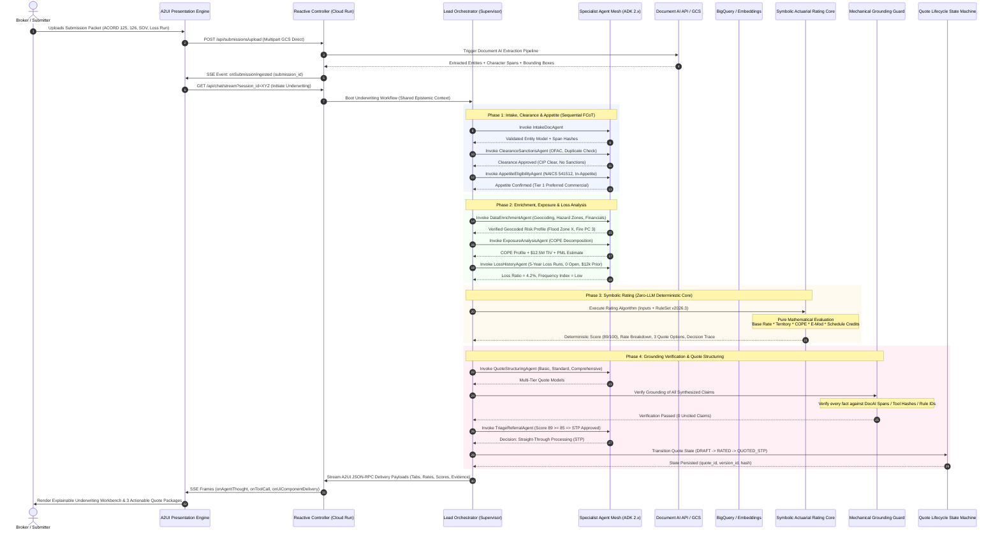

# 01. Master Architecture: Neuro-Symbolic Multi-Agent Underwriting Platform

## Executive Summary & System Mission
The **Amtha Underwriting Agentic Platform** is a production-ready, enterprise-grade multi-agent system built upon **Google Agent Development Kit (ADK) 2.x**, **A2UI (Agent UI)**, and the **Google Gen AI SDK (`google-genai`)** powered by **Gemini Enterprise on Vertex AI**. 

Engineered under **Google's AI Black Belt methodology**, the platform functions as an explainable, auditable, and trusted advisor for commercial insurance underwriting. It eliminates manual data re-keying, accelerates quote turn-around times from days to seconds, and establishes an auditable **neuro-symbolic boundary**:
- **Neural Layer (Gemini Enterprise + Doc AI + BigQuery Vector Search)**: Extraction of unstructured submission packets (ACORD forms, loss runs, SOVs), external enrichment retrieval, semantic classification, risk factor synthesis, and broker-legible natural-language justifications.
- **Symbolic Layer (Deterministic Actuarial & Rating Rules Engine)**: Zero-LLM execution. Owns 100% of mathematical scoring, debits/credits, baseline rates, premium calculations, and hard eligibility boundaries. Given identical inputs and rule versions, the system yields bitwise identical quotes, premiums, and auditable decision traces.
- **Mechanical Grounding & Citation Barrier**: Every factual claim produced by neural agents must carry a resolvable citation (document byte/character span, enrichment payload hash, or rule ID). Any uncited or unverifiable claim is mechanically blocked before reaching underwriters or brokers.

---

## High-Level Topology: Decoupled Multi-Tier Architecture

```mermaid
graph TB
    subgraph ClientTier ["Presentation & User Interaction Tier (A2UI)"]
        UI_Broker["Broker Portal (Dynamic A2UI Engine)"]
        UI_UW["Underwriter Workbench (HITL Referral Queue & Audit)"]
        A2UI_Renderer["Dynamic A2UI Component Factory (SSE / JSON-RPC 2.0)"]
        UI_Broker <--> A2UI_Renderer
        UI_UW <--> A2UI_Renderer
    end

    subgraph SecurityGateway ["Security & Zero-Trust Tool Authorization"]
        AgentGateway["Agent Gateway (Envoy Ingress/Egress Proxy)"]
        AgentIdentity["Agent Identity Provider (SPIFFE / Workload Identity Down-scoper)"]
        AgentGateway <--> AgentIdentity
    end

    subgraph OrchestrationTier ["Orchestration Tier (Cloud Run / ADK 2.x)"]
        Controller["Reactive SSE Controller API (Flask / ASGI)"]
        Supervisor["Lead Underwriting Orchestrator (FCoT Supervisor)"]
        EpistemicMemory["Shared Epistemic Context & Session Store"]
        Controller --> Supervisor
        Supervisor <--> EpistemicMemory
    end

    subgraph SpecialistAgentMesh ["Specialist Subagent Mesh (Google ADK 2.x)"]
        A_Intake["1. Intake & Doc AI Agent"]
        A_Clearance["2. Clearance & Sanctions Agent"]
        A_Appetite["3. Appetite & Eligibility Agent"]
        A_Enrich["4. Data Enrichment Agent"]
        A_Exposure["5. Exposure & COPE Analysis Agent"]
        A_Loss["6. Loss History & Claims Agent"]
        A_SymbolicRating["7. Symbolic Rating Engine (Zero-LLM Actuarial Core)"]
        A_QuoteStruct["8. Quote Options Structuring Agent"]
        A_Grounding["9. Compliance & Mechanical Grounding Guard"]
        A_Triage["10. Triage & Referral Agent (STP vs HITL)"]
        A_Lifecycle["11. Quote Lifecycle State Machine"]
        A_Audit["12. Regulatory Governance & Audit Pack Agent"]

        Supervisor --> A_Intake
        Supervisor --> A_Clearance
        Supervisor --> A_Appetite
        Supervisor --> A_Enrich
        Supervisor --> A_Exposure
        Supervisor --> A_Loss
        Supervisor --> A_SymbolicRating
        Supervisor --> A_QuoteStruct
        Supervisor --> A_Grounding
        Supervisor --> A_Triage
        Supervisor --> A_Lifecycle
        Supervisor --> A_Audit
    end

    subgraph ComputeMesh ["GKE Scalable Worker Tier"]
        GKE_DocExtract["Doc AI High-Throughput Batch Parser Pods"]
        GKE_EnvoyMesh["Envoy Sidecar Mesh (mTLS + SPIFFE Verification)"]
    end

    subgraph EnterpriseDataServices ["Google Cloud Enterprise Stack"]
        GCS["Google Cloud Storage (Submissions, Loss Runs, SOVs)"]
        DocAI["Document AI API (Document OCR & Entity Extraction)"]
        BigQuery["BigQuery (Vector Embeddings, Portfolio Risk, Audit Log)"]
        Apigee["Apigee API Management (Pending-Access Trial / Abstracted Interface)"]
        Looker["Looker Semantic Layer & Dashboards (Pending-Access Trial / Abstracted)"]
    end

    A2UI_Renderer <-->|SSE Stream / JSON-RPC| Controller
    Controller --> SecurityGateway
    SpecialistAgentMesh --> SecurityGateway
    SecurityGateway --> EnterpriseDataServices
    SecurityGateway --> ComputeMesh
    A_Intake <--> GCS & DocAI
    A_Enrich <--> BigQuery & Apigee
    A_Audit <--> BigQuery & Looker
```



---

## The 9 Required Google Cloud Services Architecture

| Service | Architecture Layer | Concrete Operational Role in Underwriting Platform | Production Implementation Strategy |
|---|---|---|---|
| **Google Cloud Storage (GCS) API** | Data Ingestion Tier | Stores raw intake submission packages (PDFs, TIFFs, Excel SOVs, loss runs) with immutability, customer-managed encryption keys (CMEK), and SHA-256 integrity tagging. | Buckets partitioned by `gs://amtha-submissions/{submission_id}/{timestamp}/raw/` with Cloud Storage object lifecycle rules. |
| **Document AI (Doc AI) API** | Perceptual Extraction Tier | Ingests unstructured policy forms, extracting normalized key-value pairs, tables, and exact text span coordinates `(page, offset_start, offset_end, bounding_box)` for citation verification. | Specialized processors (Custom Form Extractor + Specialized Financial/Insurance Parser) executed via asynchronous batch operations. |
| **BigQuery API** | Analytics & Vector Tier | Houses historical loss databases, portfolio risk aggregations, policy records, and vector embeddings (`ML.GENERATE_EMBEDDING`) for similarity matching and semantic lookups. | Columnar datasets with partitioned audit tables, vector search index (`VECTOR_SEARCH`), and row-level access control. |
| **Apigee API** | API Orchestration Tier | Enterprise API gateway exposing insurance microservices, third-party underwriting data feeds (e.g., catastrophe models, building footprints, credit), and policy admin sync. | Abstracted behind `ApigeeOrchestrationClient` interface. Local mock provider enabled for pending-access trial environments. |
| **Looker API** | Semantic & Analytics Tier | Delivers unified semantic models for underwriter loss ratios, straight-through processing (STP) yield, referral velocity, and executive portfolio dashboards. | Abstracted behind `LookerAnalyticsClient` interface. Embeds dashboard iframe tokens and semantic queries; local stub for pending-access trial. |
| **Agent Gateway API** | Security / Zero-Trust Tier | Envoy-based ingress/egress proxy intercepting all subagent tool invocations, enforcing egress network policies, mTLS, and data loss prevention (DLP). | Envoy sidecar proxies deployed across GKE and Cloud Run with mutual TLS and authorization filters. |
| **Agent Identity API** | Identity & Access Tier | Issues ephemeral, down-scoped cryptographic SPIFFE IDs to individual subagents, guaranteeing that the `clearance_agent` cannot access rating formulas or policy bind tools. | SPIFFE/SPIRE federation with Google Cloud Workload Identity, validating token claims at every tool invocation boundary. |
| **Google Kubernetes Engine (GKE) API** | High-Throughput Compute Tier | Hosts containerized asynchronous extraction workers, batch Document AI pipeline consumers, and Envoy proxy instances alongside Cloud Run. | Autopilot GKE cluster running decoupled microservices with Horizontal Pod Autoscaling (HPA) based on queue depth. |
| **Cloud Run API** | Reactive Serverless Tier | Hosts the ADK 2.x Multi-Agent supervisor engine, SSE streaming controllers, and reactive A2UI endpoints with auto-scaling to zero. | Containerized FastAPI/Flask service using non-blocking asynchronous generators and gunicorn/uvicorn workers. |

---

## End-to-End Event Sequence: Ingestion to Priced Quotes



---

## Neuro-Symbolic Boundary Contract

To satisfy strict regulatory mandates (NAIC, state insurance filings, Fair Credit Reporting Act, ECOA), the platform establishes an unbreachable wall between probabilistic neural processing and deterministic symbolic execution:

| Operation | Governing Layer | Mechanism | Determinism Guarantee | Auditability & Replayability |
|---|---|---|---|---|
| **Document Ingestion & OCR** | Neural (Doc AI + Gemini) | Character extraction, layout parsing, table structuring. | Probabilistic OCR mapped to bounding-box coordinates. | Exact character offsets `(start_idx, end_idx)` stored in immutable audit store. |
| **Clearance & OFAC Matching** | Neuro-Symbolic | Fuzzy name matching (Neural) bounded by strict threshold cutoff (Symbolic). | Score $\ge 0.85$ triggers human compliance hold; $< 0.10$ auto-clears. | OFAC SDN version date and query timestamp recorded. |
| **Appetite Classification** | Neuro-Symbolic | Semantic NAICS mapping (Neural) validated against versioned Appetite Tables (Symbolic). | Strict enum lookup against ISO/NAICS classification matrix. | Appetite Rule ID and matrix version attached to trace. |
| **External Enrichment** | Symbolic (Tools) | REST tool lookups via Agent Gateway to spatial/financial databases. | Deterministic API response storage. | Full JSON response payload SHA-256 hashed and cached. |
| **Exposure & COPE Synthesis** | Neural (LLM Agent) | Context aggregation and narrative extraction. | Grounded reasoning with span citations. | Every fact linked to source document span ID. |
| **Loss Run Analysis** | Neuro-Symbolic | Tabular loss extraction (Neural) + Actuarial Triangle math (Symbolic). | Pure deterministic loss ratio and frequency math. | Tabular line-items cited; formulas recorded in trace. |
| **Risk Scoring & Rate Computation** | **Symbolic Only (Zero-LLM)** | Versioned Actuarial Rule Engine (`RatingEngineCore`). | **100% Deterministic (Bitwise Identical on Re-runs).** | **Complete Decision Trace with Rule IDs, multipliers, and intermediate math.** |
| **Quote Option Structuring** | Symbolic + Constraint | Actuarial formula application across deductible and limit tiers. | Deterministic pricing matrix. | Quote version hash generated from input vector + rule set. |
| **Groundedness Verification** | Symbolic (Validator) | Abstract Syntax Tree (AST) entity-claim citation checker. | Binary Pass / Block enforcement. | Block log and verification certificate stored. |
| **Natural Language Justification** | Neural (LLM Agent) | Generating broker-friendly explanations of symbolic scores. | Constrained generation: only cited variables may appear. | Output verified by Grounding Guard prior to rendering. |

---

## Google ADK 2.x Hub-and-Spoke Topology & Isolation

Following enterprise best practices, all worker subagents are configured with strict routing isolation:

```python
# Subagent Isolation Configuration
worker_agent = LlmAgent(
    name="specialist_worker_agent",
    model="gemini-2.5-pro", # or enterprise gemini endpoint
    tools=[authorized_tool_suite],
    disallow_transfer_to_parent=True,  # Worker cannot command parent
    disallow_transfer_to_peers=True,   # Worker cannot route to other workers
)
```

- **Single Point of Orchestration**: The `Lead Underwriting Orchestrator` is the sole entity authorized to route tasks and receive returns.
- **Silent Tool Transfers**: Transfers are executed silently without conversational preambles, avoiding token waste and turn truncation.
- **Runtime Stabilization**: Bootstrapped with safe type stabilization proxies for A2UI / ADK compatibility, session auto-initialization, and standardized `callback_context` keyword parameter bindings.

