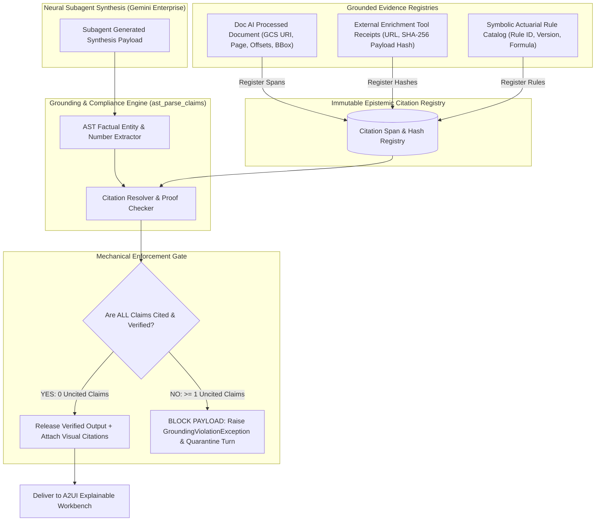

# 04. Mechanical Grounding, Zero-Hallucination Pipeline & Explainable Workbench

## The Mechanical Zero-Hallucination Principle (Requirement R5)

In commercial insurance risk assessment, an ungrounded or fabricated factual claim (e.g., hallucinating that a building has an NFPA 13 sprinkler system, misstating prior loss amounts, or altering construction class) can lead to catastrophic mispricing or regulatory sanctions.

```
+-------------------------------------------------------------------------------+
|                   MECHANICAL ZERO-HALLUCINATION CONTRACT                      |
|                                                                               |
|  1. Aspirational prompting ("Please do not hallucinate") is REJECTED.        |
|  2. Groundedness is enforced MECHANICALLY at the byte and token boundary.    |
|  3. Every single factual claim must carry a resolvable, cryptographic link to:|
|     a) A Document AI document span (URI + page + char offsets + bounding box) |
|     b) An external data enrichment API receipt (SHA-256 payload hash)         |
|     c) A symbolic actuarial rule ID (Rule ID + formula version)               |
|  4. HARD BLOCKING: Uncited claims are BLOCKED AT RUNTIME, not warned about.   |
|  5. Groundedness evals in CI gate deployment at ZERO uncited claims.          |
+-------------------------------------------------------------------------------+
```

---

## Mechanical Citation Architecture & Validation Pipeline



---

## Citation Model & Schema Specification

Every verified claim emitted by the system conforms to the `GroundedCitation` schema:

```python
from pydantic import BaseModel, Field
from typing import List, Literal, Optional, Tuple, Dict, Any

class DocumentSpanCitation(BaseModel):
    citation_type: Literal["DOCUMENT_SPAN"] = "DOCUMENT_SPAN"
    source_gcs_uri: str = Field(..., description="gs:// URI of the source PDF")
    document_name: str = Field(..., description="ACORD 125, SOV.xlsx, Loss_Run_2026.pdf")
    page_number: int
    char_start: int
    char_end: int
    bounding_box: Tuple[float, float, float, float] # [y_min, x_min, y_max, x_max] (0.0 to 1.0)
    verbatim_text: str

class ExternalEnrichmentCitation(BaseModel):
    citation_type: Literal["EXTERNAL_ENRICHMENT"] = "EXTERNAL_ENRICHMENT"
    service_name: str # "Apigee Hazard API", "ISO PPC Service"
    endpoint_url: str
    request_timestamp: str
    response_sha256: str
    json_path_query: str # e.g. "$.locations[0].flood_zone"
    raw_value: Any

class SymbolicRuleCitation(BaseModel):
    citation_type: Literal["SYMBOLIC_RULE"] = "SYMBOLIC_RULE"
    rule_id: str # "RULE-CONST-CLASS-4"
    rule_set_version: str # "v2026.3"
    formula_expression: str
    applied_parameters: Dict[str, Any]

class GroundedClaim(BaseModel):
    claim_id: str
    claim_text: str # "The property is constructed of Masonry Non-Combustible materials."
    extracted_entity: str # "Masonry Non-Combustible"
    entity_category: Literal["CONSTRUCTION", "OCCUPANCY", "PROTECTION", "TIV", "LOSS_AMOUNT", "SCORE", "ADDRESS"]
    citation: Union[DocumentSpanCitation, ExternalEnrichmentCitation, SymbolicRuleCitation]
    verified: bool
```

---

## AST Factual Claim Extractor & Mechanical Blocker

The `GroundingGuard` inspects raw subagent responses before they leave the agent boundary:

```python
class GroundingGuard:
    def __init__(self, citation_registry: CitationRegistry):
        self.registry = citation_registry

    def verify_and_enforce(self, agent_payload: Dict[str, Any]) -> Dict[str, Any]:
        """
        Mechanically parses all factual statements and numbers.
        If any claim is missing a resolvable citation in the registry,
        it immediately raises GroundingViolationException.
        """
        extracted_claims = self._ast_extract_factual_claims(agent_payload)
        unverified_claims = []

        for claim in extracted_claims:
            if not self.registry.is_valid_citation(claim.citation):
                unverified_claims.append(claim)

        if unverified_claims:
            logging.error(f"Grounding Barrier Tripped: {len(unverified_claims)} unverified claims detected.")
            raise GroundingViolationException(
                message="Submission payload contained ungrounded or uncited claims.",
                violations=[c.model_dump() for c in unverified_claims]
            )

        # Attach verifiable citation metadata to payload
        agent_payload["_grounding_audit_token"] = self.registry.generate_token()
        return agent_payload
```

---

## Explainable AI Workbench (A2UI Presentation Layer)

The presentation layer is designed to empower underwriters and brokers with **radical transparency**. Rather than presenting opaque model predictions, the A2UI workbench renders an interactive **Factor-by-Factor Score Justification** with **1-Click Evidence Drill-Down**.

```
+----------------------------------------------------------------------------------------------------+
|  AMTHA EXPLAINABLE UNDERWRITING WORKBENCH                                            Quote: Q-8821 |
|  Insured: Apex Logistics Solutions LLC | Line: Commercial Property & GL | Score: 89/100 (Preferred)|
+----------------------------------------------------------------------------------------------------+
|                                                                                                    |
|  [ Risk Score Breakdown ]  [ COPE Analysis ]  [ Loss Triangle ]  [ Multi-Tier Quotes ]  [ Audit ]  |
|                                                                                                    |
|  +----------------------------------------------------------------------------------------------+  |
|  | Factor Name             | Value / Finding              | Impact on Score | Verified Evidence |  |
|  +-------------------------+------------------------------+-----------------+-------------------+  |
|  | Construction Class      | ISO Class 4 (Masonry NC)     |  +0 pts (Base)  | [Doc Span: p.2]   |  |
|  | Fire Protection System  | 100% NFPA 13 Sprinklers      | +10 pts Credit  | [Doc Span: p.4]   |  |
|  | Public Protection Class | PPC Grade 3 (Municipal)      |  +0 pts (Base)  | [Enrichment API]  |  |
|  | 5-Year Loss History     | 0 Claims ($0.00 Incurred)    |  +8 pts Credit  | [Loss Run: p.1]   |  |
|  | Building Modernization  | Wiring/Plumbing updated 2021 |  +5 pts Credit  | [Doc Span: p.3]   |  |
|  | Flood Hazard Zone       | FEMA Zone X (Minimal Risk)   |  +0 pts (Base)  | [FEMA GIS API]    |  |
|  | Roof Age                | 6 Years Old (Installed 2020) |  +0 pts (Base)  | [Inspection Rpt]  |  |
|  +-------------------------+------------------------------+-----------------+-------------------+  |
|  | FINAL SCORE             | PREFERRED RISK (STP APPROVED)|  89 / 100       | Rule: v2026.3     |  |
|  +----------------------------------------------------------------------------------------------+  |
|                                                                                                    |
|  EVIDENCE DRILL-DOWN PANEL (When user clicks [Doc Span: p.4]):                                     |
|  +----------------------------------------------------------------------------------------------+  |
|  | Source Document: ACORD_125_Apex_Logistics.pdf | Page: 4 | Bounding Box: [0.32, 0.12, 0.45, 0.88]|  |
|  | Highlighted Text: "Building 1 is fully equipped with an NFPA 13 compliant wet pipe automatic  |  |
|  | sprinkler system inspected annually by Johnson Fire Controls (Last cert: 11/2025)."          |  |
|  | Cryptographic SHA-256 Hash: 9f83ac12... [Verified Grounded]                                   |  |
|  +----------------------------------------------------------------------------------------------+  |
|                                                                                                    |
|  [ Download Regulator Audit Pack (ZIP) ]  [ Bind Preferred Quote ($29,294.62) ]  [ Re-rate Policy ]|
+----------------------------------------------------------------------------------------------------+
```

### Dynamic A2UI Schema Payloads (`onUiComponentDelivery`)

The backend streams structured JSON-RPC frames over SSE to dynamically assemble this interface without client-side recompilation:

```json
{
  "jsonrpc": "2.0",
  "method": "onUiComponentDelivery",
  "params": {
    "author": "lead_underwriting_orchestrator",
    "ui_specification": "2.0",
    "payload": {
      "type": "Tabs",
      "id": "workbench_main_tabs",
      "components": [
        {
          "title": "Factor Justification",
          "type": "Table",
          "id": "factor_justification_table",
          "headers": ["Risk Factor", "Extracted Value", "Score Impact", "Evidence Citation"],
          "rows": [
            [
              "Construction Class",
              "ISO Class 4 (Masonry Non-Combustible)",
              "0 pts (Standard)",
              {"type": "CitationLink", "target_id": "span_acord125_p2_c104", "label": "ACORD 125 (p.2)"}
            ],
            [
              "Sprinkler System",
              "100% NFPA 13 Wet Pipe System",
              "+10 pts (Credit)",
              {"type": "CitationLink", "target_id": "span_acord125_p4_c82", "label": "ACORD 125 (p.4)"}
            ],
            [
              "5-Year Loss Record",
              "0 Loss Events / $0.00 Incurred",
              "+8 pts (Credit)",
              {"type": "CitationLink", "target_id": "span_lossrun_p1_c12", "label": "Loss Run 5-Yr"}
            ]
          ]
        },
        {
          "title": "Quote Options",
          "type": "QuoteOptionCards",
          "id": "quote_option_selector",
          "options": [
            {
              "tier": "Basic",
              "premium": 24850.00,
              "property_limit": 10000000.0,
              "deductible": 5000.0,
              "recommended": false
            },
            {
              "tier": "Preferred (Recommended)",
              "premium": 29294.62,
              "property_limit": 12500000.0,
              "deductible": 2500.0,
              "recommended": true
            },
            {
              "tier": "Comprehensive",
              "premium": 34120.00,
              "property_limit": 15000000.0,
              "deductible": 10000.0,
              "recommended": false
            }
          ]
        }
      ]
    }
  }
}
```

