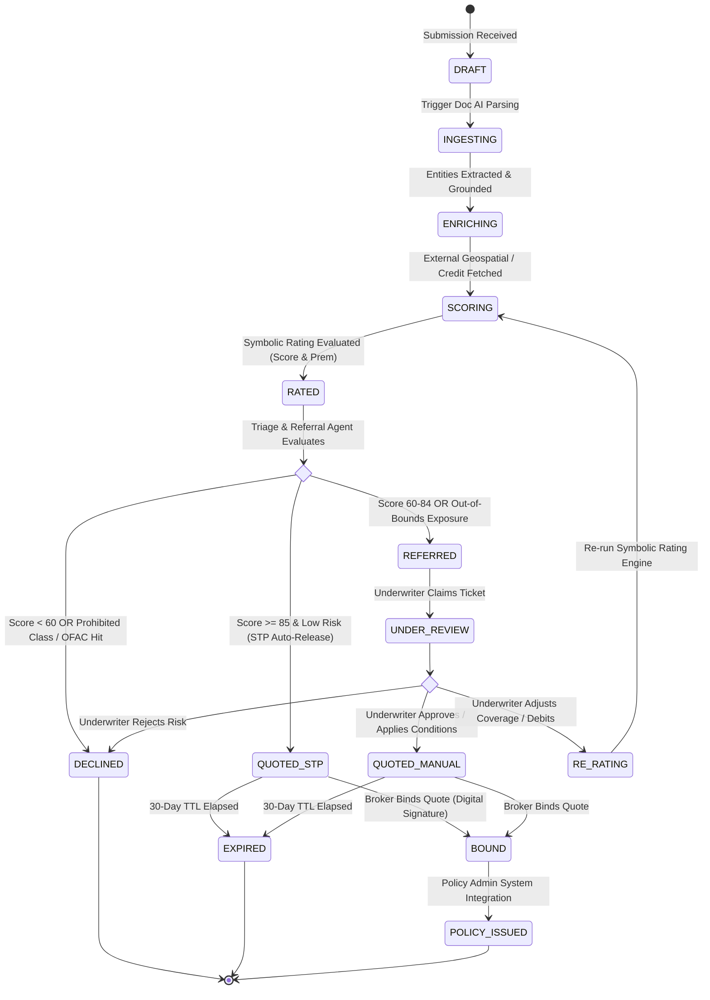

# 05. Quote Lifecycle State Machine & Human-In-The-Loop (HITL) Workflows

## The Zero-Orphan & Anti-Fragmentation Guarantee (Requirement R3)

In enterprise underwriting, quote fragmentation (multiple conflicting versions of a quote active simultaneously) and orphaned quotes (quotes lost in unmonitored queues or disconnected from policy documents) create severe financial and regulatory liabilities.

```
+-------------------------------------------------------------------------------+
|                    QUOTE INTEGRITY & NON-FRAGMENTATION CONTRACT               |
|                                                                               |
|  1. Every quote is governed by a strictly validated Finite State Machine (FSM).|
|  2. Single Source of Truth: State transitions are written to an append-only   |
|     BigQuery Event Ledger (`quote_lifecycle_events`) with strict CAS locks.   |
|  3. Zero Orphaned Quotes: Automated TTL watchdogs notify brokers/underwriters |
|     at T-7, T-3, and T-1 days before quote expiration.                        |
|  4. Zero Fragmentation: A quote version hash locks the exact combination of   |
|     (Intake Data + Enriched Factors + Rule Version + Pricing Matrix). Any      |
|     modification spawns a clean child version (v2, v3) while archiving v1.   |
+-------------------------------------------------------------------------------+
```

---

## Quote Lifecycle Finite State Machine (FSM)



---

## State Transition Matrix & Validation Rules

| Current State | Permitted Next States | Trigger Event | Guard Condition / Validation | Target Storage Event |
|---|---|---|---|---|
| `DRAFT` | `INGESTING`, `CANCELLED` | Upload Complete | Valid GCS URI and SHA-256 hash | `Event(INITIATE_INGESTION)` |
| `INGESTING` | `ENRICHING`, `INGESTION_FAILED` | Doc AI Complete | 100% extracted entities grounded with character spans | `Event(ENTITIES_EXTRACTED)` |
| `ENRICHING` | `SCORING`, `ENRICHMENT_FAILED` | APIs Returned | Geospatial, PPC, and credit hashes recorded | `Event(ENRICHMENT_RECORDED)` |
| `SCORING` | `RATED` | Symbolic Engine Return | Zero-LLM mathematical trace generated and verified | `Event(RATING_COMPUTED)` |
| `RATED` | `QUOTED_STP`, `REFERRED`, `DECLINED` | Triage Evaluation | Score thresholds & authority matrix rules | `Event(TRIAGE_DECIDED)` |
| `REFERRED` | `UNDER_REVIEW` | UW Claimed | Underwriter SSO ID assigned to ticket | `Event(UNDERWRITER_ASSIGNED)` |
| `UNDER_REVIEW` | `QUOTED_MANUAL`, `RE_RATING`, `DECLINED` | UW Decision | Mandatory written underwriter rationale entered | `Event(UW_DECISION_LOGGED)` |
| `QUOTED_STP` / `QUOTED_MANUAL` | `BOUND`, `EXPIRED`, `CANCELLED` | Bind Order / TTL | Valid payment authorization & broker signature | `Event(POLICY_BOUND)` |

---

## Triage Routing: Straight-Through Processing (STP) vs Referral Hierarchy

```
+-----------------------------------------------------------------------------------------------------+
|                                    TRIAGE ROUTING SPECIFICATION                                     |
+--------------------------+-----------------------+----------------------+---------------------------+
| Risk Tier                | Risk Score Criteria   | Exposure Boundaries  | Action Protocol           |
+--------------------------+-----------------------+----------------------+---------------------------+
| TIER 1: STP AUTO-RELEASE | Score >= 85           | - TIV <= $15M        | - Instant multi-tier quote|
| (Straight-Through)       | Preferred Appetite    | - Flood Zone X/C     |   released to broker      |
|                          | 0 Open Claims         | - Wildfire <= 5.0    | - Zero human intervention |
|                          | 5-Yr Loss Ratio < 20% | - Sprinklers 100%    | - 30-day price lock       |
+--------------------------+-----------------------+----------------------+---------------------------+
| TIER 2: UW REFERRAL      | Score 70 - 84         | - TIV $15M - $25M    | - Routes to UW Desk       |
| (Standard Underwriter)   | Standard Appetite     | - Wildfire 5.1 - 7.0 | - Underwriter Brief auto- |
|                          | Loss Ratio 20% - 40%  | - PPC Grade 5 - 6    |   generated with context  |
+--------------------------+-----------------------+----------------------+---------------------------+
| TIER 3: SENIOR UW        | Score 60 - 69         | - TIV $25M - $50M    | - Senior UW approval req. |
| (Senior Authority)       | Specialty Class       | - Flood Zone AE      | - Mandatory roof cert     |
|                          | Loss Ratio 40% - 60%  | - Wildfire 7.1 - 8.5 | - Schedule debit applied  |
+--------------------------+-----------------------+----------------------+---------------------------+
| TIER 4: CHIEF UW / VP    | Score 60 - 69         | - TIV > $50M         | - Executive sign-off req. |
| (Executive Sign-Off)     | Complex Multi-State   | - Flood Zone V / VE  | - Treaty reinsurance check|
+--------------------------+-----------------------+----------------------+---------------------------+
| TIER 5: AUTO-DECLINE     | Score < 60            | - Prohibited NAICS   | - Formal declination letter|
| (Declined Submission)    | Sanctions Hit (OFAC)  | - Unsprinklered Wood |   generated with statutory|
|                          | Unresolved CIP Fraud  |   Frame in High Cat  |   adverse action reasons  |
+--------------------------+-----------------------+----------------------+---------------------------+
```

---

## The Structured Underwriter Referral Brief

When a submission lands in the Referral Queue, the `triage_referral_agent` compiles an actionable, evidence-dense **Referral Brief** for the underwriter:

```markdown
# UNDERWRITER REFERRAL BRIEF — SUBMISSION #SUB-2026-90412
**Insured**: Apex Logistics Solutions LLC | **Line**: Commercial Property & GL
**Overall Risk Score**: 76 / 100 (Tier 2 Standard Referral)
**Assigned Authority Level**: Underwriter II

---

### 1. Primary Referral Triggers (Why this requires human review)
1. **Total Insured Value ($18.5M)**: Exceeds standard STP authority threshold of $15.0M.
   - *Evidence*: [SOV.xlsx — Location 1 & 2 Building Schedules (Line 4-12)](citation://span_sov_p1)
2. **Wildfire Risk Index (6.4 / 10.0)**: Suburban brush exposure within 1,200 ft of eastern perimeter.
   - *Evidence*: [Apigee Hazard GIS Service Response #HZR-9912](citation://payload_sha256_hzr9912)
3. **Roof Age (18 Years)**: Original built-up roof system nearing end-of-life on Building 2.
   - *Evidence*: [ACORD 140 Form (p.2, Section 3)](citation://span_acord140_p2)

---

### 2. Prioritized Underwriter Recommendations & Conditions
- [ ] **Condition 1 (Prior to Bind)**: Require updated commercial roof inspection report certifying minimum 3-year remaining useful life.
- [ ] **Condition 2 (Coverage Structuring)**: Apply a $10,000 Wind/Hail separate deductible on Building 2.
- [ ] **Condition 3 (Pricing Adjustment)**: Apply +10% discretionary schedule debit (`RULE-SCHED-ROOF-AGE-15`) to offset wildfire perimeter exposure.

---

### 3. Quick Action Controls (HITL Direct Actions in Workbench)
- `[ ACCEPT RISK WITH CONDITIONS ]` -> Auto-updates quote schedules and emits binding terms.
- `[ REQUEST RE-RATE WITH OVERRIDE ]` -> Launches symbolic recalculation modal.
- `[ DECLINE RISK ]` -> Emits FCRA-compliant notice to broker.
```

---

## Underwriter Human-in-the-Loop Override Interface

The A2UI presentation layer provides underwriters with structured override controls:
1. **Mandatory Justification**: Underwriters cannot override rating factors without entering a structured business justification (selected from standard underwriting rationales or annotated with engineering reports).
2. **Deterministic Re-Execution**: When an underwriter adjusts a parameter (e.g., changing schedule rating from $0.00$ to $+0.10$), the platform immediately re-executes the **Symbolic Rating Engine** in real-time, outputting an updated auditable decision trace.
3. **Audit Immutability**: The override event is recorded with the underwriter's employee ID, timestamp, prior values, new values, and attached justification in the BigQuery ledger.

