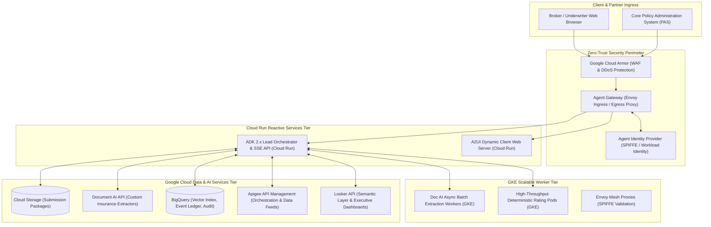
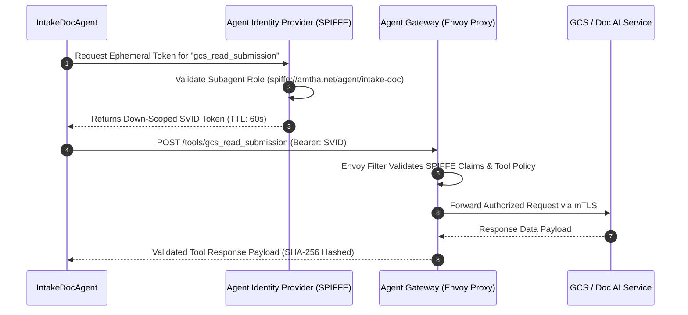
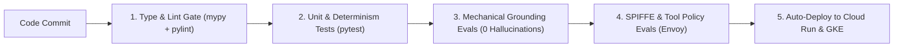

# 06. Infrastructure, Security, Zero-Trust Tool Authorization & CI/CD

## System Infrastructure Architecture & The 9 Google Cloud Services

The platform deploys across a resilient, hybrid **Serverless (Cloud Run) + High-Throughput Container (GKE)** architecture orchestrated via Terraform infrastructure-as-code.



---

## The 9 Google Cloud Services: Configuration & Topology

```
+---------------------------------------------------------------------------------------------------------+
|                                  THE 9 GOOGLE CLOUD SERVICES TOPOLOGY                                   |
+----+-----------------------+------------------------+---------------------------------------------------+
| #  | Service               | Resource Identifier    | Operational Responsibility                        |
+----+-----------------------+------------------------+---------------------------------------------------+
| 01 | Cloud Storage API     | `gcs-amtha-submissions`| Durable, encrypted intake repository for PDFs,    |
|    |                       |                        | TIFFs, Excel SOVs, and loss run documents.        |
+----+-----------------------+------------------------+---------------------------------------------------+
| 02 | Document AI API       | `docai-insurance-v2`   | Specialized Document AI processors extracting     |
|    |                       |                        | entity keys, values, character spans, and bboxes. |
+----+-----------------------+------------------------+---------------------------------------------------+
| 03 | BigQuery API          | `bq_underwriting_dw`   | Event ledger, historical claims vector embeddings |
|    |                       |                        | (`VECTOR_SEARCH`), and audit logs.                |
+----+-----------------------+------------------------+---------------------------------------------------+
| 04 | Apigee API            | `apigee-gateway-prod`  | API orchestration for geospatial, hazard, credit, |
|    |                       |                        | and external data feeds. (Trial stubbed).         |
+----+-----------------------+------------------------+---------------------------------------------------+
| 05 | Looker API            | `looker-semantic-layer`| Semantic modeling for loss ratios, referral queue |
|    |                       |                        | velocity, and executive BI. (Trial stubbed).      |
+----+-----------------------+------------------------+---------------------------------------------------+
| 06 | Agent Gateway API     | `envoy-agent-gateway`  | Envoy egress/ingress proxy enforcing tool-level   |
|    |                       |                        | authorization and mTLS between subagents.         |
+----+-----------------------+------------------------+---------------------------------------------------+
| 07 | Agent Identity API    | `spiffe-agent-identity`| Down-scopes cryptographic identity tokens to      |
|    |                       |                        | grant least-privilege tool execution capabilities.|
+----+-----------------------+------------------------+---------------------------------------------------+
| 08 | GKE API               | `gke-amtha-compute-cl` | Autopilot GKE cluster running high-throughput     |
|    |                       |                        | asynchronous batch extraction and sidecars.       |
+----+-----------------------+------------------------+---------------------------------------------------+
| 09 | Cloud Run API         | `cloudrun-amtha-agent` | Serverless runtime hosting the reactive ADK 2.x   |
|    |                       |                        | supervisor engine and real-time SSE endpoints.    |
+----+-----------------------+------------------------+---------------------------------------------------+
```

---

## Pending-Access Dependency Management: Apigee & Looker

> [!IMPORTANT]
> **Delivery Risk Tracking**: Scott Hitchcock is requesting trial environments for **Apigee** and **Looker**. 
> To ensure zero development bottlenecks, both services are architected behind strictly typed abstract interfaces with robust local mock providers.

### 1. Abstract Interface & Local Mock Architecture

```python
# interfaces/apigee_interface.py
from abc import ABC, abstractmethod
from typing import Dict, Any

class IApigeeOrchestrator(ABC):
    @abstractmethod
    async def fetch_hazard_risk_data(self, address: str, lat: float, lon: float) -> Dict[str, Any]:
        """Queries external hazard feeds via Apigee Gateway."""
        pass

    @abstractmethod
    async def fetch_iso_protection_class(self, address: str) -> Dict[str, Any]:
        """Queries ISO PPC ratings via Apigee Gateway."""
        pass

# interfaces/looker_interface.py
class ILookerAnalytics(ABC):
    @abstractmethod
    async def query_portfolio_loss_ratio(self, naics_code: str, territory: str) -> Dict[str, Any]:
        """Retrieves semantic layer portfolio benchmarks from Looker."""
        pass

    @abstractmethod
    async def get_dashboard_embed_url(self, session_id: str, underwriter_id: str) -> str:
        """Generates authenticated Looker dashboard embed URI."""
        pass
```

### 2. Dependency Risk Matrix & Mitigation Strategy

| Dependency | Owner | Current Status | Risk Impact | Local Mitigation / Fallback |
|---|---|---|---|---|
| **Apigee Trial** | Scott Hitchcock | Access Pending | Low (Mitigated) | `MockApigeeOrchestrator` loaded dynamically via environment flag `USE_MOCK_APIGEE=true`. Provides deterministic hazard responses with identical schemas. |
| **Looker Trial** | Scott Hitchcock | Access Pending | Low (Mitigated) | `MockLookerAnalytics` loaded dynamically via `USE_MOCK_LOOKER=true`. Emits mock semantic query responses and static dashboard embed URLs. |

---

## Zero-Trust Tool Authorization: Agent Gateway & SPIFFE Identity

To prevent tool privilege escalation (e.g., an intake agent attempting to execute a policy bind tool or access pricing databases), every tool invocation passes through **Agent Gateway** with a down-scoped **SPIFFE ID**:



### Subagent Tool Authorization Policy Matrix

| Subagent Name | SPIFFE Identity URI | Authorized Tools | Denied Tools (Enforced by Envoy) |
|---|---|---|---|
| `intake_doc_agent` | `spiffe://amtha.net/agent/intake-doc` | `gcs_read`, `docai_batch_process` | `quote_bind`, `rating_override`, `ofac_write` |
| `clearance_sanctions_agent` | `spiffe://amtha.net/agent/clearance` | `ofac_lookup`, `cip_verify` | `gcs_write`, `quote_bind`, `rating_override` |
| `data_enrichment_agent` | `spiffe://amtha.net/agent/enrichment` | `apigee_hazard`, `apigee_ppc` | `quote_bind`, `docai_modify`, `ofac_write` |
| `symbolic_rating_engine` | `spiffe://amtha.net/agent/rating` | Pure Math Only (No Network) | **ALL NETWORK TOOLS DENIED** |
| `quote_lifecycle_agent` | `spiffe://amtha.net/agent/lifecycle` | `bq_ledger_write`, `quote_bind` | `docai_batch_process`, `ofac_write` |

---

## Infrastructure as Code: Terraform Multi-Service Blueprint

The system provisions all 9 Google Cloud services using modular Terraform scripts in `infra/terraform/`:

```hcl
# infra/terraform/main.tf
terraform {
  required_version = ">= 1.5.0"
  required_providers {
    google = {
      source  = "hashicorp/google"
      version = "~> 5.20"
    }
  }
}

provider "google" {
  project = var.project_id
  region  = var.region
}

# 1. Google Cloud Storage
resource "google_storage_bucket" "submissions_bucket" {
  name          = "${var.project_id}-amtha-submissions"
  location      = var.region
  force_destroy = false
  uniform_bucket_level_access = true
  versioning {
    enabled = true
  }
}

# 2. Document AI Processor
resource "google_document_ai_processor" "insurance_parser" {
  location     = "us"
  display_name = "amtha-insurance-parser"
  type         = "FORM_PARSER_PROCESSOR"
}

# 3. BigQuery Dataset
resource "google_bigquery_dataset" "underwriting_dw" {
  dataset_id                  = "amtha_underwriting_dw"
  location                    = var.region
  default_table_expiration_ms = null
}

# 4. Cloud Run Supervisor Service
resource "google_cloud_run_v2_service" "agent_orchestrator" {
  name     = "amtha-agent-orchestrator"
  location = var.region
  ingress  = "INGRESS_TRAFFIC_ALL"

  template {
    containers {
      image = "gcr.io/${var.project_id}/amtha-orchestrator:latest"
      env {
        name  = "GOOGLE_GENAI_USE_VERTEXAI"
        value = "true"
      }
      env {
        name  = "GOOGLE_CLOUD_PROJECT"
        value = var.project_id
      }
    }
  }
}

# 5. GKE Autopilot Cluster
resource "google_container_cluster" "compute_cluster" {
  name     = "amtha-compute-cluster"
  location = var.region
  enable_autopilot = true
}
```

---

## CI/CD Quality Gates & Groundedness Evals

Every Pull Request and commit must pass automated CI pipeline gates before deployment:



1. **Deterministic Replay Evals**: Evaluates 10,000 synthetic test policies through `SymbolicRatingEngine` to ensure `0.00%` drift in rates or scores.
2. **Groundedness Evals**: Runs simulated extraction pipelines through `GroundingGuard`. Any output yielding an uncited claim immediately fails the build.
3. **SPIFFE Policy Enforcement Evals**: Runs mock agent payloads attempting unauthorized tool calls to verify Envoy Gateway blocks them with `403 Forbidden`.

