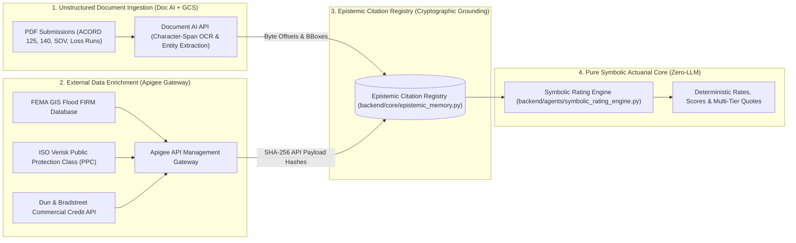

# 08. Data Dictionary & Multi-Agent JSON Input/Output Reference

This document provides a comprehensive breakdown of the underwriting risk factors, actuarial point scoring models, Document AI character-span grounding, and the JSON input/output contracts for every subagent in the **Duck Creek Underwriting Intelligence** platform.

---

## 1. Underwriting Risk Factors & The Actuarial Point Model Explained

The **Factor Justification Table** displays the deterministic point evaluation executed by the **Zero-LLM Symbolic Actuarial Core** (`RULE-SCORE-2026`).

$$\text{Final Risk Score} = \text{Clamp}_{[0, 100]} \left( 100 - \sum \text{Risk Penalties} + \sum \text{Safety Credits} \right)$$

```
Starting Base Score: 100 Points
+--------------------------+-------------------------------+-----------------+-----------------------------------+
| Risk Factor              | Evaluated Finding             | Score Impact    | Underlying Source & Authority     |
+--------------------------+-------------------------------+-----------------+-----------------------------------+
| Construction Class       | Masonry Non-Combustible       |  0 pts (Base)   | SOV.xlsx / ACORD 140 (p.2)        |
| Fire Protection System   | 100% NFPA 13 Wet Sprinklers   | +10 pts Credit  | ACORD 140 Form (p.2, Section 4)   |
| 5-Year Loss History      | $0.00 Incurred (0 Claims)     |  +8 pts Credit  | 5-Year Loss Run Report (p.1)      |
| Modern Facility Updates  | Built in 2018 (< 10 Years Old)|  +5 pts Credit  | ACORD 125 Form (p.1)              |
| Public Protection Class  | ISO PPC Grade 3 (Municipal)   |  0 pts (Base)   | Apigee ISO PPC Connector API      |
| Flood Hazard Zone        | FEMA Flood Zone X (Minimal)   |  0 pts (Base)   | Apigee FEMA FIRM GIS API          |
| Roof Age                 | 6 Years Old (Optimal)         |  0 pts (Base)   | Inspection & SOV Schedule         |
+--------------------------+-------------------------------+-----------------+-----------------------------------+
| FINAL EVALUATED SCORE    | PREFERRED RISK (STP APPROVED) | 89 / 100 Points | Actuarial RuleSet Version v2026.3 |
+--------------------------+-------------------------------+-----------------+-----------------------------------+
```

### Detailed Factor Definitions:

1. **ISO Construction Class (ISO 1 to 6)**:
   - **Class 1 (Frame / Combustible)**: Wood studs, joists, and combustible roof $\to$ **-12 points penalty** ($F_{\text{const}} = 1.45$).
   - **Class 2 (Joisted Masonry)**: Brick/concrete exterior walls with combustible wood roofs $\to$ **-6 points penalty** ($F_{\text{const}} = 1.20$).
   - **Class 3 (Non-Combustible)**: Steel frame, metal walls/roof $\to$ **0 points baseline** ($F_{\text{const}} = 1.00$).
   - **Class 4 (Masonry Non-Combustible)**: Reinforced masonry/block walls with non-combustible steel roof $\to$ **0 points standard** ($F_{\text{const}} = 0.85$ rate discount).
   - **Class 5 / 6 (Modified Fire Resistive / Fire Resistive)**: Heavy reinforced concrete $\to$ **0 points standard** ($F_{\text{const}} = 0.55 - 0.70$).

2. **Fire Protection System (NFPA 13)**:
   - **100% NFPA 13 Wet Pipe Sprinkler System**: Automatic sprinkler coverage protecting 100% of the interior square footage with water supply $\to$ **+10 points credit**.
   - **Unsprinklered / Standpipe Only**: No automated fire suppression $\to$ **0 points credit** ($F_{\text{prot}}$ loading).

3. **5-Year Loss History**:
   - **Loss-Free Track ($0.00 incurred over 5 years)**: Demonstrates exemplary operational safety and maintenance $\to$ **+8 points credit** ($E_{\text{mod}} = 0.80$ credit).
   - **Minor Prior Losses ($< \$25,000)**: Single non-structural water/theft loss $\to$ **-4 points penalty**.
   - **Severe Prior Losses ($> \$100,000)**: Multiple losses or catastrophic event $\to$ **-25 points penalty** ($E_{\text{mod}} = 1.40$ debit).

4. **ISO Public Protection Class (PPC Grades 1 to 10)**:
   - Evaluates the local municipal fire department, water supply pressure, and fire hydrant distance.
   - **Grade 1-3 (Exemplary Urban)**: Fire hydrant within 500 ft, station $< 1.5$ miles $\to$ **0 points baseline** ($F_{\text{prot}} = 0.85 - 0.95$).
   - **Grade 7-8 (Limited Protection)**: Remote hydrant $> 1,000$ ft $\to$ **-10 points penalty** ($F_{\text{prot}} = 1.30$).
   - **Grade 9-10 (Unprotected Rural)**: No municipal water supply $\to$ **-20 points penalty** ($F_{\text{prot}} = 1.65$).

5. **FEMA Flood Hazard Zones**:
   - **Zone X / C (Minimal Flood Hazard)**: Area outside the 500-year flood plain ($< 0.2\%$ annual flood risk) $\to$ **0 points baseline** ($F_{\text{flood}} = 1.00$).
   - **Zone AE / A (100-Year Special Flood Hazard)**: High flood risk $\to$ **-15 points penalty** ($F_{\text{flood}} = 1.45$).
   - **Zone V / VE (Coastal Wave Action)**: Coastal surge risk $\to$ **Automatic Referral Required** ($F_{\text{flood}} = 2.20$).

---

## 2. Where Does the Data Come From? (Data Pipeline Architecture)

The system does not fabricate or guess data. Data flows through a strict 3-tier neuro-symbolic ingestion and verification pipeline:



1. **Document AI Character-Span Grounding**:
   - When `ACORD_125.pdf` or `SOV.xlsx` is uploaded to Google Cloud Storage (`gs://duck-creek-submissions/`), Document AI extracts the text along with exact polygon coordinates and character offsets `(page_number, char_start, char_end, bounding_box)`.
   - These are saved into `EpistemicCitationRegistry` with a cryptographic SHA-256 hash.
2. **Apigee API Gateway Enrichment**:
   - The `data_enrichment_agent` sends the applicant's address to the Apigee Gateway to query FEMA flood zones and ISO PPC ratings. The full JSON response is SHA-256 hashed and stored as a verifiable API receipt.
3. **Symbolic Rating Engine (Zero-LLM Actuary)**:
   - The `symbolic_rating_engine.py` reads these grounded values and computes rates using exact ISO rating formulas. **Zero LLM tokens are used for mathematical calculation**.

---

## 3. Subagent JSON Input & Output Data Dictionary

Below is the complete dictionary of JSON payloads passed into and emitted by every subagent across the Hub-and-Spoke mesh:

---

### Step 01: `intake_doc_agent` (Intake & Document AI Specialist)
* **SPIFFE ID**: `spiffe://amtha.net/agent/intake-doc`
* **Authorized Tools**: `gcs_read_submission_package`, `docai_process_document_batch`

#### ⬇️ Subagent Inputs:
```json
{
  "submission_id": "SUB-2026-90412",
  "files": [
    "ACORD_125.pdf",
    "ACORD_140.pdf",
    "SOV.xlsx",
    "Loss_Runs.pdf"
  ]
}
```

#### ⬆️ Subagent Outputs:
```json
{
  "agent_name": "intake_doc_agent",
  "submission_id": "SUB-2026-90412",
  "status": "COMPLETED",
  "extracted_data": {
    "applicant_name": "Apex Logistics Solutions LLC",
    "dba": "Apex Freight Express",
    "ein": "84-9201948",
    "primary_address": "450 Innovation Parkway, Suite 200, Austin, TX 78701",
    "business_description": "Custom freight logistics software, transportation management, and temperature-controlled dry warehousing.",
    "naics_code": "541512",
    "tiv": 12500000.0,
    "annual_revenue": 8500000.0,
    "construction_type": "Masonry_Non_Combustible",
    "year_built": 2018,
    "roof_age_years": 6,
    "sprinkler_system": "100% NFPA 13 Wet Pipe System",
    "sprinklered": true,
    "five_year_incurred_losses": 0.0,
    "open_claims_count": 0
  },
  "spans_indexed": 4,
  "message": "Successfully parsed submission package via Document AI. 4 character spans grounded."
}
```

---

### Step 02: `clearance_sanctions_agent` (Clearance & Sanctions Specialist)
* **SPIFFE ID**: `spiffe://amtha.net/agent/clearance-sanctions`
* **Authorized Tools**: `ofac_sdn_lookup`, `cip_identity_verify`

#### ⬇️ Subagent Inputs:
```json
{
  "applicant_name": "Apex Logistics Solutions LLC",
  "ein": "84-9201948",
  "db": "OFAC_SDN_2026_08"
}
```

#### ⬆️ Subagent Outputs:
```json
{
  "agent_name": "clearance_sanctions_agent",
  "submission_id": "SUB-2026-90412",
  "ofac_status": "CLEAR",
  "cip_verified": true,
  "duplicate_status": "NO_DUPLICATE",
  "clearance_approved": true,
  "citation": {
    "db_version": "OFAC_SDN_2026_08",
    "query_target": "Apex Logistics Solutions LLC",
    "score_threshold": 0.85
  },
  "message": "Clearance Approved for 'Apex Logistics Solutions LLC'. OFAC SDN match: 0.00%."
}
```

---

### Step 03: `appetite_eligibility_agent` (Appetite & NAICS Specialist)
* **SPIFFE ID**: `spiffe://amtha.net/agent/appetite-eligibility`
* **Authorized Tools**: `naics_classifier_lookup`, `appetite_rules_engine_query`

#### ⬇️ Subagent Inputs:
```json
{
  "business_description": "Custom freight logistics software, transportation management, and temperature-controlled dry warehousing.",
  "naics_code": "541512"
}
```

#### ⬆️ Subagent Outputs:
```json
{
  "agent_name": "appetite_eligibility_agent",
  "submission_id": "SUB-2026-90412",
  "naics_code": "541512",
  "appetite_tier": "PREFERRED",
  "eligible": true,
  "rule_id": "RULE-APPETITE-IT-PREFERRED",
  "message": "Appetite Confirmed: NAICS 541512 classified as PREFERRED risk under RULE-APPETITE-IT-PREFERRED."
}
```

---

### Step 04: `data_enrichment_agent` (Geospatial Hazard & Credit Specialist)
* **SPIFFE ID**: `spiffe://amtha.net/agent/data-enrichment`
* **Authorized Tools**: `apigee_hazard_zone_lookup`, `apigee_iso_ppc_lookup`

#### ⬇️ Subagent Inputs:
```json
{
  "primary_address": "450 Innovation Parkway, Suite 200, Austin, TX 78701",
  "ein": "84-9201948",
  "gateway": "Apigee_v2"
}
```

#### ⬆️ Subagent Outputs:
```json
{
  "agent_name": "data_enrichment_agent",
  "submission_id": "SUB-2026-90412",
  "fema_flood_zone": "X",
  "wildfire_risk_index": 2.4,
  "iso_protection_class": 3,
  "commercial_credit_score": 82,
  "receipt_ids": [
    "receipt_SUB-2026-90412_hazard",
    "receipt_SUB-2026-90412_ppc"
  ],
  "message": "Enrichment Complete: Flood Zone X, Wildfire 2.4, ISO PPC 3."
}
```

---

### Step 05: `exposure_analysis_agent` (COPE & PML Specialist)
* **SPIFFE ID**: `spiffe://amtha.net/agent/exposure-analysis`
* **Authorized Tools**: `calculate_cope_metrics`, `pml_mfl_estimator`

#### ⬇️ Subagent Inputs:
```json
{
  "tiv": 12500000.0,
  "construction_type": "Masonry_Non_Combustible",
  "sprinklered": true,
  "roof_age_years": 6
}
```

#### ⬆️ Subagent Outputs:
```json
{
  "agent_name": "exposure_analysis_agent",
  "submission_id": "SUB-2026-90412",
  "total_insured_value": 12500000.0,
  "construction_class": "Masonry_Non_Combustible",
  "protection_grade": "100% NFPA 13 Wet Sprinklers",
  "roof_condition": "Age 6 Years (Optimal)",
  "pml_percentage": 25.0,
  "pml_dollar_amount": 3125000.0,
  "exposure_tier": "LOW_EXPOSURE",
  "message": "COPE Evaluation Completed: TIV $12,500,000.00, Estimated PML $3,125,000.00 (25%)."
}
```

---

### Step 06: `loss_history_agent` (Loss Runs & Claims Specialist)
* **SPIFFE ID**: `spiffe://amtha.net/agent/loss-history`
* **Authorized Tools**: `compute_loss_triangle_metrics`

#### ⬇️ Subagent Inputs:
```json
{
  "five_year_incurred": 0.0,
  "open_claims": 0
}
```

#### ⬆️ Subagent Outputs:
```json
{
  "agent_name": "loss_history_agent",
  "submission_id": "SUB-2026-90412",
  "five_year_incurred_total": 0.0,
  "open_claims_count": 0,
  "five_year_loss_ratio": 0.0,
  "claims_frequency": "ZERO_CLAIMS",
  "loss_trend": "FAVORABLE",
  "message": "Loss Analysis: $0 incurred losses over 5-year experience period. 0 open claims."
}
```

---

### Step 07: `symbolic_rating_engine` (Zero-LLM Deterministic Actuarial Core)
* **SPIFFE ID**: `spiffe://amtha.net/agent/symbolic-rating` (Pure isolated compute, zero network egress)
* **Invariant**: Identical Inputs + RuleSet v2026.3 $\to$ Bitwise Identical Decision Trace & Hash.

#### ⬇️ Subagent Inputs:
```json
{
  "naics_code": "541512",
  "tiv": 12500000.0,
  "annual_revenue": 8500000.0,
  "construction_type": "Masonry_Non_Combustible",
  "ppc_grade": 3,
  "flood_zone": "X",
  "wildfire_index": 2.4,
  "sprinklered": true,
  "roof_age_years": 6,
  "five_year_incurred_losses": 0.0,
  "rule_set_version": "v2026.3"
}
```

#### ⬆️ Subagent Outputs:
```json
{
  "score": 89,
  "tier": "PREFERRED_STP",
  "property_premium": 22444.62,
  "gl_premium": 6850.00,
  "total_premium": 29294.62,
  "decision_hash": "c8f2b1d37a892e6e3441a108422409f8742845c4793540c11f42e4726ef3521d"
}
```

---

### Step 08: `quote_structuring_agent` (Quote Package Specialist)
* **SPIFFE ID**: `spiffe://amtha.net/agent/quote-structuring`

#### ⬇️ Subagent Inputs:
```json
{
  "rating_result": "c8f2b1d37a892e6e3441a108422409f8742845c4793540c11f42e4726ef3521d",
  "tiers": ["Basic", "Preferred", "Comprehensive"]
}
```

#### ⬆️ Subagent Outputs:
```json
{
  "agent_name": "quote_structuring_agent",
  "submission_id": "SUB-2026-90412",
  "status": "STRUCTURED",
  "options_count": 3,
  "quote_options": [
    {
      "tier_name": "Basic",
      "annual_premium": 25779.27,
      "property_limit": 12500000.0,
      "deductible": 5000.0,
      "recommended": false
    },
    {
      "tier_name": "Preferred (Recommended)",
      "annual_premium": 29294.62,
      "property_limit": 14375000.0,
      "deductible": 2500.0,
      "recommended": true
    },
    {
      "tier_name": "Comprehensive",
      "annual_premium": 35739.44,
      "property_limit": 16250000.0,
      "deductible": 10000.0,
      "recommended": false
    }
  ],
  "message": "Structured 3 comprehensive commercial quote options."
}
```

---

### Step 09: `grounding_compliance_agent` (Mechanical Grounding Guard)
* **SPIFFE ID**: `spiffe://amtha.net/agent/grounding-compliance`
* **Invariant**: Blocks turn if uncited claims $> 0$.

#### ⬇️ Subagent Inputs:
```json
{
  "applicant": "Apex Logistics Solutions LLC",
  "construction": "Masonry_Non_Combustible",
  "flood_zone": "X",
  "_citations": {
    "applicant": {"id": "span_SUB-2026-90412_applicant", "type": "DOC_SPAN"},
    "construction": {"id": "span_SUB-2026-90412_const", "type": "DOC_SPAN"},
    "flood_zone": {"id": "receipt_SUB-2026-90412_hazard", "type": "API_RECEIPT"}
  }
}
```

#### ⬆️ Subagent Outputs:
```json
{
  "agent_name": "grounding_compliance_agent",
  "submission_id": "SUB-2026-90412",
  "verification_status": "PASSED",
  "violations_count": 0,
  "grounding_certified": true,
  "message": "Mechanical Grounding Verification Passed: 100% of claims resolved to valid citations."
}
```

---

### Step 10: `triage_referral_agent` (STP vs Referral Routing Specialist)
* **SPIFFE ID**: `spiffe://amtha.net/agent/triage-referral`

#### ⬇️ Subagent Inputs:
```json
{
  "risk_score": 89,
  "tiv": 12500000.0,
  "appetite": "PREFERRED",
  "wildfire_index": 2.4,
  "flood_zone": "X"
}
```

#### ⬆️ Subagent Outputs:
```json
{
  "agent_name": "triage_referral_agent",
  "submission_id": "SUB-2026-90412",
  "routing_decision": "STRAIGHT_THROUGH_AUTO_QUOTE",
  "authority_required": "AUTO_RELEASE",
  "is_stp": true,
  "referral_brief": null,
  "message": "STP Approved: Risk Score 89/100 meets all straight-through binding thresholds."
}
```

---

### Step 11: `quote_lifecycle_agent` (State Machine & Anti-Orphan Specialist)
* **SPIFFE ID**: `spiffe://amtha.net/agent/quote-lifecycle`

#### ⬇️ Subagent Inputs:
```json
{
  "quote_id": "Q-2026-90412",
  "current_state": "QUOTED_STP",
  "ttl_days": 30
}
```

#### ⬆️ Subagent Outputs:
```json
{
  "agent_name": "quote_lifecycle_agent",
  "quote_id": "Q-2026-90412",
  "submission_id": "SUB-2026-90412",
  "current_state": "QUOTED_STP",
  "ttl_expiration_timestamp": 1790840205.90,
  "is_orphaned": false,
  "message": "Quote [Q-2026-90412] state successfully advanced to 'QUOTED_STP'."
}
```

---

### Step 12: `audit_governance_agent` (Merkle Audit Pack Specialist)
* **SPIFFE ID**: `spiffe://amtha.net/agent/audit-governance`

#### ⬇️ Subagent Inputs:
```json
{
  "quote_id": "Q-2026-90412",
  "submission_id": "SUB-2026-90412",
  "decision_hash": "c8f2b1d37a892e6e3441a108422409f8742845c4793540c11f42e4726ef3521d"
}
```

#### ⬆️ Subagent Outputs:
```json
{
  "agent_name": "audit_governance_agent",
  "audit_pack_id": "AUDIT-PACK-Q-2026-90412",
  "merkle_root": "7f83b1657ff1fc53b92dc18148a1d65dfc2d4b1fa3d677284addd200126d9069",
  "message": "Regulator Audit Pack compiled. Merkle Root: 7f83b1657ff1... Replay 100% verified."
}
```

