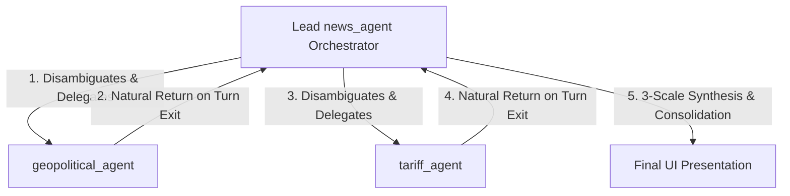

# Multi-Agent Development Guide: Best Practices for Google ADK & A2UI

This guide serves as a definitive playbook for engineering stable, high-performance, and visually stunning multi-agent applications using the Google Cloud Agentic Stack (Agent Development Kit & Agent UI). 

By adhering to these production-proven best practices and architectural corrections, engineering teams can minimize trial-and-error, prevent runtime regressions, and ensure complex multi-agent pipelines execute correctly in their first-round runs.

---

## 1. Architectural Blueprint (Hub-and-Spoke)

For structured orchestration (e.g., a lead agent coordinating specialized workers), always enforce a strict **Hub-and-Spoke** topology. Workers must never communicate with each other directly or command their parent.



### Subagent Routing Isolation
To guarantee the integrity of this topology, lock down subagent routing by setting these options to `True` in the subagent constructors:
```python

for all sub agents:

sub_agent_name = LlmAgent(
    name="sub_agent",
    tools=[google_search],
    disallow_transfer_to_parent=True,  # Prevents worker from trying to command parent
    disallow_transfer_to_peers=True,   # Prevents worker from trying to call other workers
)
```
* **Impact**: Avoids infinite routing loops, ensures predictable token usage, and centralizes synthesis inside the orchestrator.

---

## 2. Integration Failure Points & First-Round Corrections

When building custom backend services (such as a Flask or FastAPI server) to run ADK agents, several core framework integration points will fail out-of-the-box. Enforce these corrections from **Day 1**:

### Failure Point A: A2UI Site-Package Import Mismatches
* **The Issue**: The `a2ui-agent-sdk` (v0.2.1) relies on `a2a.types` exporting `DataPart` and `TextPart` Pydantic models. However, the newer `a2a` (v1.0+) SDK uses Protobuf message classes directly, throwing a fatal `ImportError` upon start-up.
* **Day-1 Best Practice**: Apply a lightweight, safe module monkeypatch at the very entry point of your application (before importing any ADK or A2UI components):
```python
import sys
import a2a.types
from a2a.compat.v0_3.types import DataPart, TextPart
a2a.types.DataPart = DataPart
a2a.types.TextPart = TextPart
sys.modules['a2a.types'] = a2a.types
```

### Failure Point B: ADK Session Not Found on Async Runners
* **The Issue**: Running agents directly via `InMemoryRunner.run_async(...)` will throw a fatal `SessionNotFoundError: Session not found` if the session has not been explicitly created in the runner's storage service beforehand.
* **Day-1 Best Practice**: Enable auto-session creation on the runner instance, and explicitly check/create the session in the service prior to starting the generator:
```python
runner = InMemoryRunner(agent=root_agent)
runner.auto_create_session = True  # Enable auto-create attribute

# Explicitly create session if missing
session = await runner.session_service.get_session(
    app_name=runner.app_name,
    user_id="user_default",
    session_id=session_id
)
if not session:
    await runner.session_service.create_session(
        app_name=runner.app_name,
        user_id="user_default",
        session_id=session_id
    )
```

### Failure Point C: ADK Callback Parameter Binding
* **The Issue**: The ADK engine invokes user-defined agent callbacks by explicitly mapping keyword arguments (i.e., `callback(callback_context=ctx)`). Declaring callbacks with positional parameters (like `def before_agent_callback(ctx):`) will trigger a fatal `TypeError`.
* **Day-1 Best Practice**: Always declare `before_agent_callback` and `after_agent_callback` parameters using the exact parameter name `callback_context`:
```python
def before_agent_callback(callback_context):
    print(f"Activated: {callback_context.agent_name}")
    return None
```

---

## 3. Disciplined Multi-Step Orchestration & Prompt Design

When queries cover multiple domains of expertise, LLMs often make the first delegation call, receive a detailed subagent response, and immediately exit—"forgetting" to invoke the second subagent.

### Day-1 Best Practice: Sequential Sequencer & Disambiguated Handoff
Configure the orchestrator's instructions to enforce strict state tracking, sequential turns, and silent immediate transfers:
```
1. **Query Intent & Relevance Analysis**: If the query does NOT relate to global trade, tariffs, duties, or geopolitics, DO NOT invoke any subagent. Answer natively.
2. **Query Disambiguation**: Disambiguate the query to isolate specific research parameters for each subagent. Do NOT pass the user's original query as-is.
3. **Sequential Execution & State Tracking**:
   - You must execute your delegation plan sequentially—one subagent per turn. 
   - When activated, check the conversation history:
     * **Step A**: If trade research is needed and `tariff_agent` has NOT yet been called, you MUST immediately invoke `transfer_to_agent(agent_name="tariff_agent")` as your sole action. Do NOT write conversational text or wait.
     * **Step B**: If geopolitical research is needed and `geopolitical_agent` has NOT yet been called, you MUST immediately invoke `transfer_to_agent(agent_name="geopolitical_agent")` as your sole action. Do NOT write conversational text or wait.
     * **Step C**: Only when ALL relevant research is successfully returned should you consolidate the findings.
```
* **Why this works**: The silent tool transfer prevents the model from yielding conversational text that would prematurely conclude its execution turn, ensuring both subagents are fully invoked.

---

## 4. High-Reasoning Consolidation (Hillclimbing)

When compiling findings, do not let the orchestrator simply concatenate or summarize text. Force it to perform a disciplined synthesis across multiple scales, gap-check itself, and hillclimb to provide operational recommendations.

### Macro-Meso-Micro Synthesis Rules
1. **Macro-Scale Analysis**: Synthesize broad, high-level global trends, systemic dynamics, and overarching geopolitical alignments.
2. **Meso-Scale Analysis**: Analyze sector-specific trends, regional trade impacts, supply chain vulnerabilities, and industry-level structures (e.g., semiconductor fab dependencies, rare earth alliances).
3. **Micro-Scale Analysis**: Deep-dive into specific, exact policy updates, exact tariff rates, immediate company implications (e.g., TSMC, Nvidia, DeepSeek), and granular data points.
4. **Hillclimbing Pass**: Review the draft critically. Determine what was missed or glossed over at each scale, resolve any contradictions between subagent inputs, fill the gaps, and iteratively refine the analysis to deliver a flawless executive summary with detailed recommendations.

---

## 5. Premium Front-end Visual Architecture

A premium multi-agent user interface must visually represent the cognitive stack and prevent "hanging" states when subagents do the heavy lifting.

### Core UI Best Practices
1. **Predictive Handoff Glows**:
   - Intercept the orchestrator's `transfer_to_agent` function call events in the frontend Javascript before their execution actually starts.
   - Inspect the `agent_name` argument, and immediately light up the target subagent node in your sidebar visualizer (e.g., setting status to `Activating` with a pulsing neon glow). This removes visual lag and makes the interface feel highly responsive.
2. **Dynamic Subagent Chat Cards**:
   - Do not dump all text generated by subagents into the main orchestrator text bubble.
   - Instead, dynamically create dedicated, visually separated "Subagent Research Cards" inside the chat window. Stream the subagent's findings directly inside its dedicated card in real-time.
3. **Self-Cleaning Placeholders (Prevent UI Hangs)**:
   - When the orchestrator delegates all tasks and produces no final text at the end of its turn, the final loading placeholder bubble (`"Consolidating research..."`) will hang on the screen.
   - Implement an automatic cleanup in your Javascript: if the stream completes and the final orchestrator message contains only the placeholder text and no A2UI components, **remove the empty placeholder bubble from the DOM**:
     ```javascript
     if (accumulatedText.trim() === '' && a2uiAnchor.children.length === 0) {
         agentMessageDiv.remove();
     }
     ```

---

## 6. Zero-Dependency Test Strategy

To make sure the application can be tested easily in both local development and serverless Cloud Run containers, write standalone integration tests using Python's standard library `unittest` instead of relying on external test runners like `pytest`:
* **Mocking**: Use `unittest.mock.patch` to mock the `InMemoryRunner` async generator stream, allowing you to verify endpoint routing and SSE event construction instantly (under `<0.1s`) without calling actual LLM APIs or hitting network quotas.
